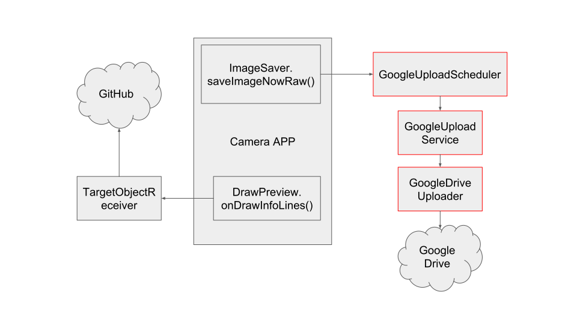

# Programmer Guide

## Overview
This App is a modification of [Open Camera](https://sourceforge.net/projects/opencamera/). It can upload raw images and can display the target objects that we want user to collect.

The starting point a raw image upload is in Open Camera's `ImageSaver.saveImageNowRaw()`. This function makes a upload request via GoogleUploadScheduler. The Scheduler queues the request and will perform upload via GoogleDriveUploader when wifi is available. The upload process is run as a background service.

To display target objects, the app calls TargetObjectReceiver.drawTarget() in `DrawPreview.onDrawInfoLines()` to download and print the `target_object.txt` file at the root of this repo.

## Reference
1. Volley https://developer.android.com/training/volley/
2. Android upload service https://github.com/gotev/android-upload-service
3. Android Job Scheduler https://developer.android.com/reference/android/app/job/JobScheduler
4. Google Drive API https://developers.google.com/drive/v3/web/manage-uploads
